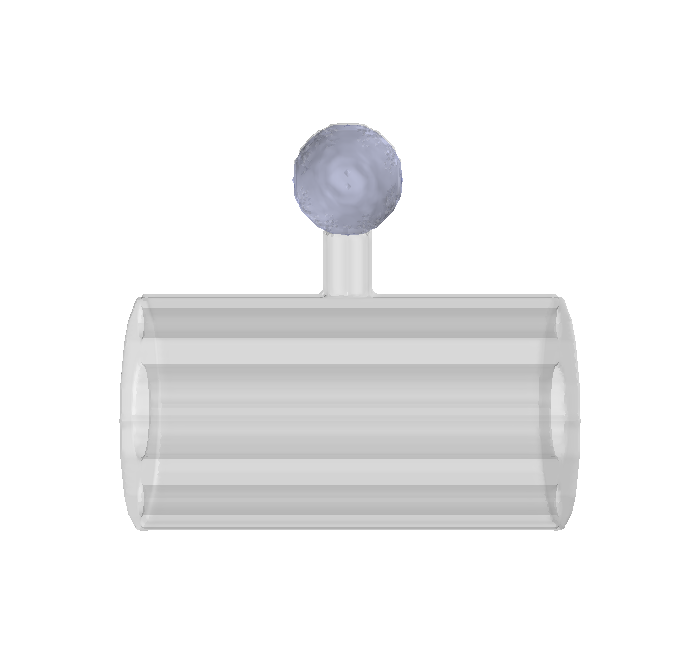

=====================================
Annotation using the UNI-EM annotator
=====================================

Open the annotator of UNI-EM.

Label region-of-interests. Labeled areas are automatically saved.

.. image:: imgs/UNI-EM_annot2.jpg
   :scale: 50%
   :align: center

Convert the labeled areas to the voxel space.

.. code-block:: python
	:linenos:

	import sys, os, errno
	import numpy as np
	import h5py
	from pyLD import *

	folder    = 'annot_ball_and_stick'
	volume_id = 1
	output_filename = 'labels_ball_and_stick.h5'

	const = GenerateClosedVolumesFromUniEM(folder)
	vol, ids, ref_vol = const.generate(volume_id)
	with h5py.File(output_filename, 'w') as f:
		f.create_dataset('labels', data=vol)
		f['vol'] = vol
		f['ids'] = ids
		f['ref_vol'] = ref_vol

.. image:: imgs/painted.jpg
   :scale: 50%
   :align: center

Confirm the successful segmentation in the voxel space by visualizing it.

.. code-block:: python
	:linenos:

	output_image_filename = 'labels_ball_and_stick.png'
	xypitch = 0.02

	from mayavi import mlab
	from mayavi.api import OffScreenEngine
	import trimesh

	mlab.figure(bgcolor=(1.0,1.0,1.0), size=(700,700))
	mlab.view(90, 90, 300, [ 50, 30, 50 ] )

	for id in ids:
		vert, face,_ ,_ = create_surface(xypitch, vol == id)
		vert = vert / xypitch
		mlab.triangular_mesh(vert[:,0], vert[:,1], vert[:,2], face, color=tuple(np.random.rand(3))  , opacity=0.3)

	vert, face, _, _ = create_surface(xypitch, ref_vol ^ (vol > 0))
	vert = vert / xypitch
	mlab.triangular_mesh(vert[:,0], vert[:,1], vert[:,2], face, color=(0.8,0.8,0.8)  , opacity=0.3)
	mlab.savefig(output_image_filename)
	mlab.show()

That is all for annotation.
