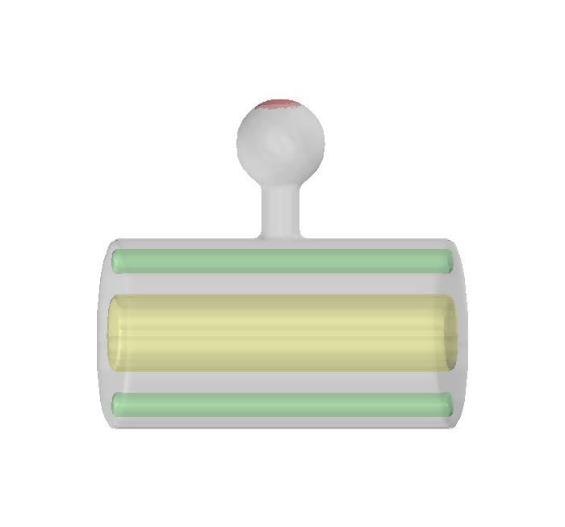

================================
Create a shape of spiny dendrite
================================

We first designed a schematics shape of spiny dendrite.

.. image:: imgs/Scheme.jpg
   :scale: 60%
   :align: center

.. literalinclude:: ../../tutorial/1/main1_create_dend1.py
   :language: python
   :linenos:

.. literalinclude:: ../../tutorial/1/main1_create_dend2.py
   :language: python
   :linenos:

That is all.

