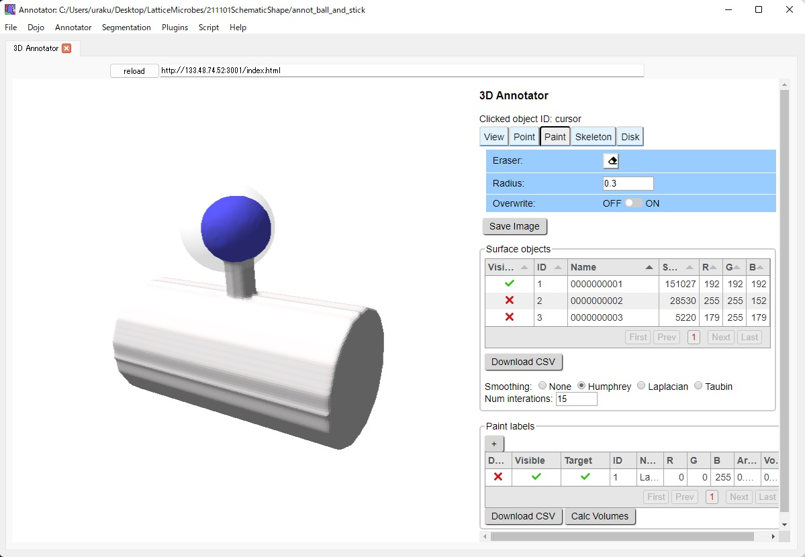
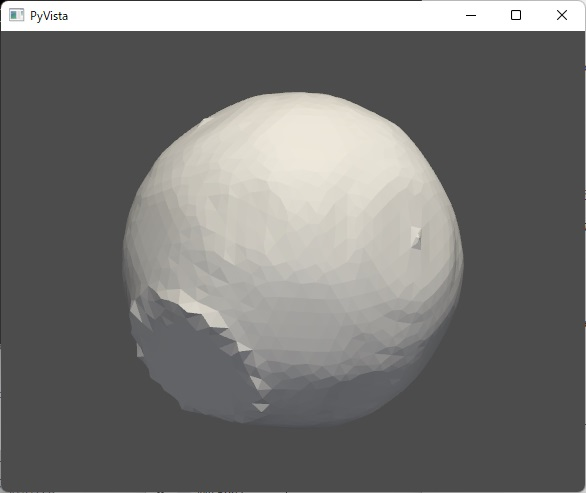
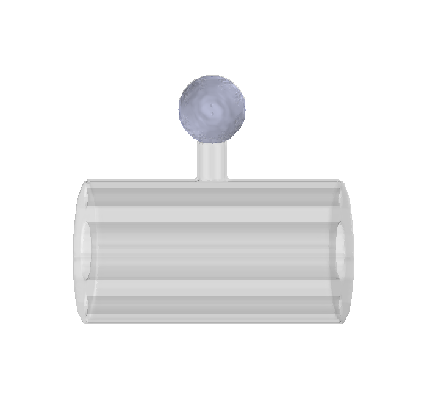

=============
Label a spine
=============

We would like to label a spine to obtain the concentration of a molecule. HU also developed software, UNI-EM annotator, to label any region-of-interests on the surface of objects.
Launch UNI-EM and open the 'annot_ball_and_stick' folder from 'Open Annotator Folder' of the pulldown menu 'Annotator'. Label the spine head in the UNI-EM annotator. Labeled areas are automatically saved.

Convert the labeled areas to the voxel space.

.. code-block:: python
	:linenos:

	import sys, os, errno
	import numpy as np
	import h5py
	from pyLD import *

	folder    = 'annot_ball_and_stick'
	volume_id = 1
	output_filename = 'labels_ball_and_stick.h5'

	const = GenerateClosedVolumesFromUniEM(folder)
	vol, ids, ref_vol = const.generate(volume_id)
	with h5py.File(output_filename, 'w') as f:
		f.create_dataset('labels', data=vol)
		f['vol'] = vol
		f['ids'] = ids
		f['ref_vol'] = ref_vol

Confirm the successful segmentation in the voxel space by visualizing it.

.. code-block:: python
	:linenos:

	output_image_filename = 'labels_ball_and_stick.png'
	xypitch = 0.02

	from mayavi import mlab
	from mayavi.api import OffScreenEngine
	import trimesh

	mlab.figure(bgcolor=(1.0,1.0,1.0), size=(700,700))
	mlab.view(90, 90, 300, [ 50, 30, 50 ] )

	for id in ids:
		vert, face,_ ,_ = create_surface(xypitch, vol == id)
		vert = vert / xypitch
		mlab.triangular_mesh(vert[:,0], vert[:,1], vert[:,2], face, color=tuple(np.random.rand(3))  , opacity=0.3)

	vert, face, _, _ = create_surface(xypitch, ref_vol ^ (vol > 0))
	vert = vert / xypitch
	mlab.triangular_mesh(vert[:,0], vert[:,1], vert[:,2], face, color=(0.8,0.8,0.8)  , opacity=0.3)
	mlab.savefig(output_image_filename)
	mlab.show()

The spiny dendrite has a geometric shape. We can thus programmably label the spine, not using the UNI-EM annotator, as follows.

.. code-block:: python
	:linenos:
	
	import os
	import numpy as np
	import h5py
	from skimage import morphology
	from pyLD import *

	input_morpho_filename = 'ball_and_stick.h5'
	output_label_filename = 'labels_ball_and_stick.h5'

	def add_shape(volume, object, loc_center):
		s = np.array(object.shape)
		c = np.floor(s/2).astype(int)
		b = loc_center - c
		e = b + s
		volume[b[0]:e[0], b[1]:e[1], b[2]:e[2] ] += object
		volume = (volume > 0).astype(np.uint8)
		return volume

	print('Load morpho file')
	with h5py.File( input_morpho_filename,'r' ) as f:
	    vol_dend_not_mito_not_er = f['dendrite not mitochondrion not ER'][()]

	print('Label spine')
	spine_head   = morphology.ball(radius = 12)
	label_volume = np.zeros_like(vol_dend_not_mito_not_er)
	label_volume = add_shape(label_volume, spine_head, [48,30,76])

	label_ids     = np.array([1])
	label_volume = (label_volume > 0) * label_ids[0]
	ref_volume   = vol_dend_not_mito_not_er ^ label_volume

	print('Save label')
	with h5py.File(output_label_filename, 'a') as f:
		f['label volume'] = label_volume
		f['label ids']    = label_ids
		f['ref volume']   = ref_volume

	
That is all for annotation.
