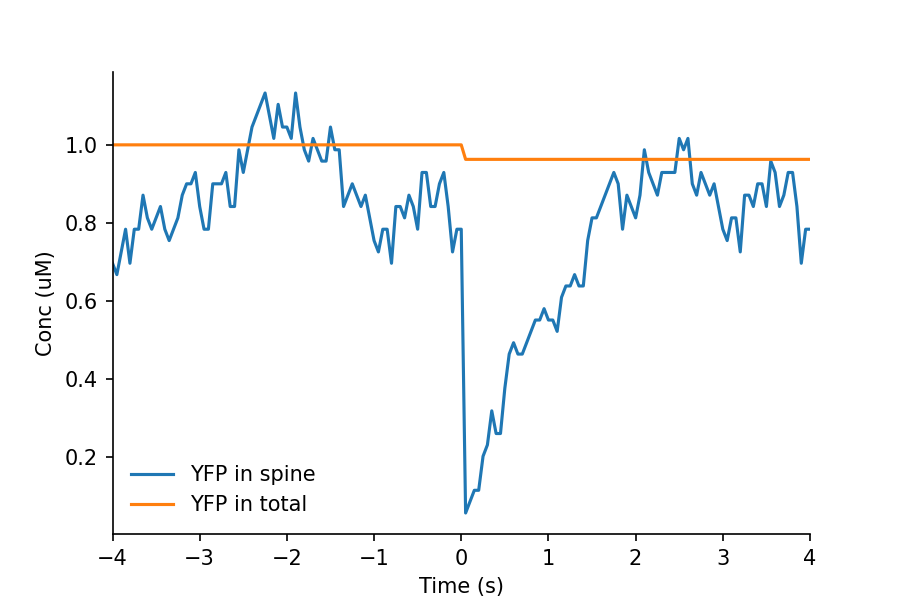

===========================
Visualization 1: graph plot
===========================

Total numbers/concs of molecules were calculated in the process of simulation. The utility class ConnectTotalConcs can be used to plot concs on matplotlib.

The numbers/concs of molecules in labeled volumes (such as the spine) first need to be calculated using the class GetLabeledConcs. The caluculated numbers/concs were connected by the class ConnectLabeledConcs, which can be used to plot concs using matplotlib.

.. literalinclude:: ../../tutorial/1/51_plot_conc.py
   :language: python
   :linenos:
   :caption: 51_plot_conc.py

.. image:: imgs/profile_Ca.png
   :scale: 50%
   :align: center

That is all for visulaization 1.
