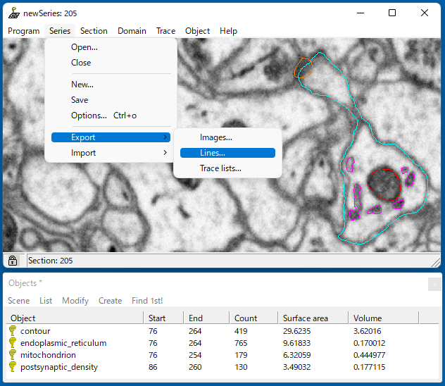
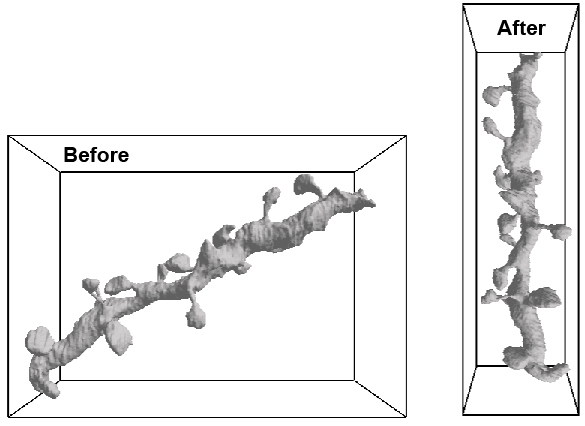
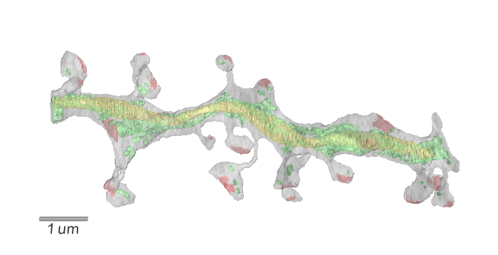

.. include:: ../isonum.txt
.. include:: ../isogrk1.txt

===============================
Import a shape from Reconstruct
===============================

This section begins with a result of manual labeling in the software 'Reconstruct' [#Fiala]_. The EM data comes from a previous research (FIB-SEM) [#Laxmi1]_ [#Laxmi2]_, and we have already labeled a segment of dendrite (cyan), endoplasmic reticula (ER; magenta), mitochondrion (red), and postsynaptic densities (PSDs; orange) (below). Those labels were exported by the command in the pull-down menu 'Series |rarr| Export |rarr| Lines'. A series of the 'dxf' files were saved to a specified directory. The exported files are stored in the directory $LD_DIRECTORY/tutorial/2/dxf_files (newSeries.0.dxf, newSeries.1.dxf, ...) for this tutorial.

|

The 'dxf' files can be read by the CreateVolumeFromReconstruct class (Lines 20-21 in 11_import_dend.py). This class obtains an ordered list of dxf files in the specified directory (dir_dxfs, Lines 10, 20), and the class method 'create' generates a volume that contains the specified named object (Lines 11-14, 21). In this case, the volumes of the dendrite, ER, mitochondrion, and PSDs are generated as numpy 3D arrays of dend, er, mito, and psd, respectively.

.. literalinclude:: ../../tutorial/2/11_import_dend.py
   :language: python
   :linenos:
   :caption: 11_import_dend.py

|

Then, the generated volumes are rotated to obtain a minimum bounding box of the objects (Figure below). This is because LM computes the reaction-diffusion of molecules in the cuboid space, the minimization of a dead space decreases the total amount of computation. We have already known that the dendritic object spans the largest volume; therefore, the RotateVolume class first obtains the rotation of the dendrite as a reference (vol_dend, Line 26), and the other objects (er, mito, psd) are rotated in a same manner (Lines 27). This process is executed only in the X-Z plane, because the same process has already been done in the generation of the target volumes, regarding the X-Y plane (Lines 20-21). The RotateVolume class is based on cv2.minAreaRect that computes the convex hull.

|

The rotated volumes are then padded with a space to have the size of a multiple of 32 |times| 32 |times| 32 (Lines 33-34 in 11_import_dend.py). In addition, their boundaries are smoothed using one-step pairs of erosion and dilution (Lines 47-50). Finally, as in the case of schematic dendrite, their surface meshes are generated, and all of them are saved in the HDF file 'models/realistic_dendrite.h5' (Lines 53-86).

The generated dendrite can be visualized by the script '12_show_dend.py' as follows:

.. literalinclude:: ../../tutorial/2/12_show_dend.py
   :language: python
   :linenos:
   :caption: 12_show_dend.py

|

.. rubric:: References
.. [#Fiala] Fiala JC (2005) Reconstruct: A free editor for serial section microscopy, J. Microscopy 218: 52-61, https://synapseweb.clm.utexas.edu/software-0
.. [#Laxmi1] Parajuli LK, Urakubo H, Takahashi-Nakazato A, Ogelman R, Iwasaki H, Koike M, Kwon HB, Ishii S, Oh WC, Fukazawa Y, and Okabe S (2020) Geometry and the organizational principle of spine synapses along a dendrite, eNeuro 27, ENEURO.0248-20.2020
.. [#Laxmi2] Parajuli LK and Koike M (2021) Three-Dimensional Structure of Dendritic Spines Revealed by Volume Electron Microscopy Techniques, Front. Neuroanat. 15:627368.

