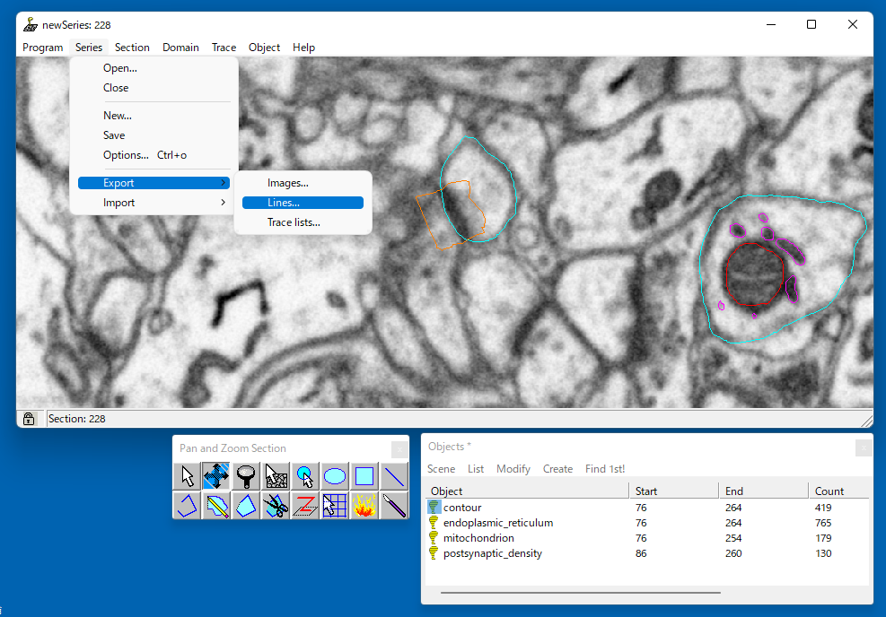

===============================
Import a shape from Reconstruct
===============================

Convert the labeled areas to labeled volumes, and save them.

.. literalinclude:: ../../tutorial/2/11_import_dend.py
   :language: python
   :linenos:
   :caption: 11_import_dend.py

That is all for importing.
