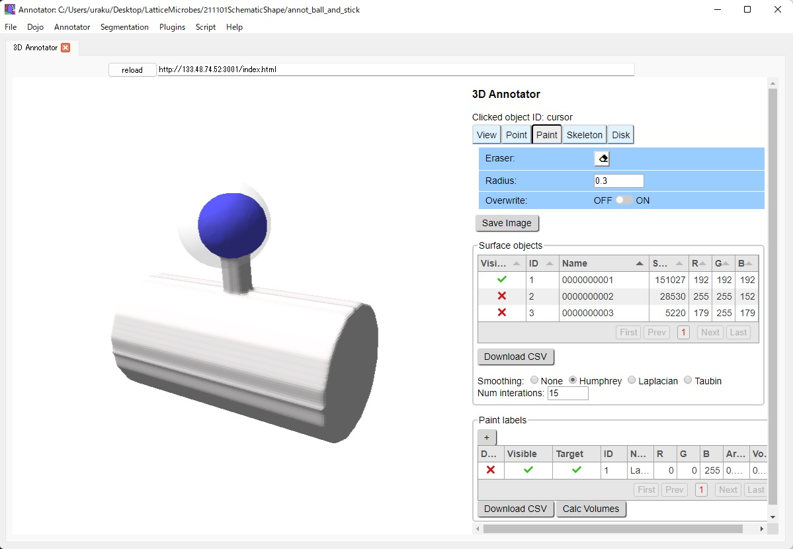
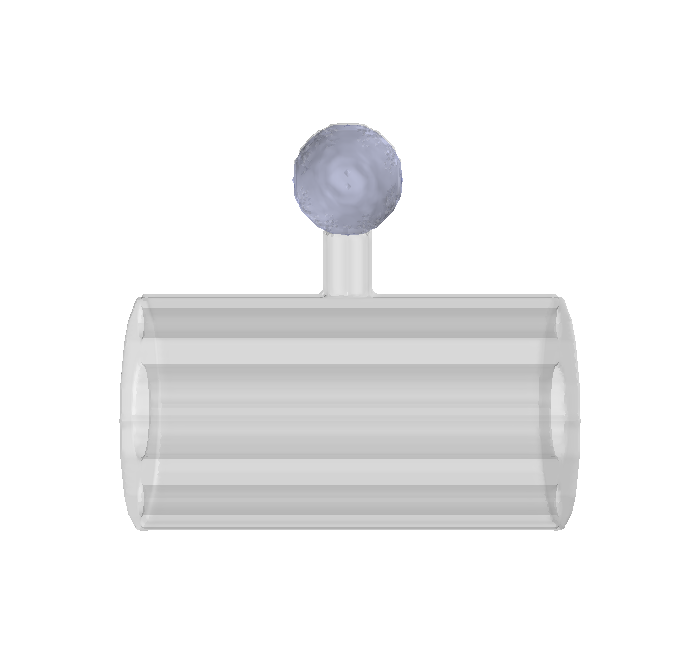

=========================
Label spines using UNI-EM
=========================

We would like to label a spine volume to obtain molecular concentration of this region. To enable it, HU also developed software, UNI-EM annotator, to manually label any region-of-interests on the surface of objects, and it also serves to obtain volumes within the labeled regions. 

Launch UNI-EM and open the 'dend01' folder from 'Open Annotator Folder' of the pulldown menu 'Annotator'. Label the spine head in the UNI-EM annotator. Labeled areas are automatically saved.

Convert the labeled areas to labeled volumes, and save them.

.. literalinclude:: ../../tutorial/2/21_convert_to_annotator.py
   :language: python
   :linenos:
   :caption: 21_convert_to_annotator.py

.. image:: imgs/painted.jpg
   :scale: 50%
   :align: center

.. literalinclude:: ../../tutorial/2/22_obtain_from_annotator.py
   :language: python
   :linenos:
   :caption: 22_obtain_from_annotator.py

Confirm the successful segmentation in the voxel space by visualizing it.

.. literalinclude:: ../../tutorial/1/22_show_label.py
   :language: python
   :linenos:
   :caption: 22_show_label.py

That is all for labeling.
